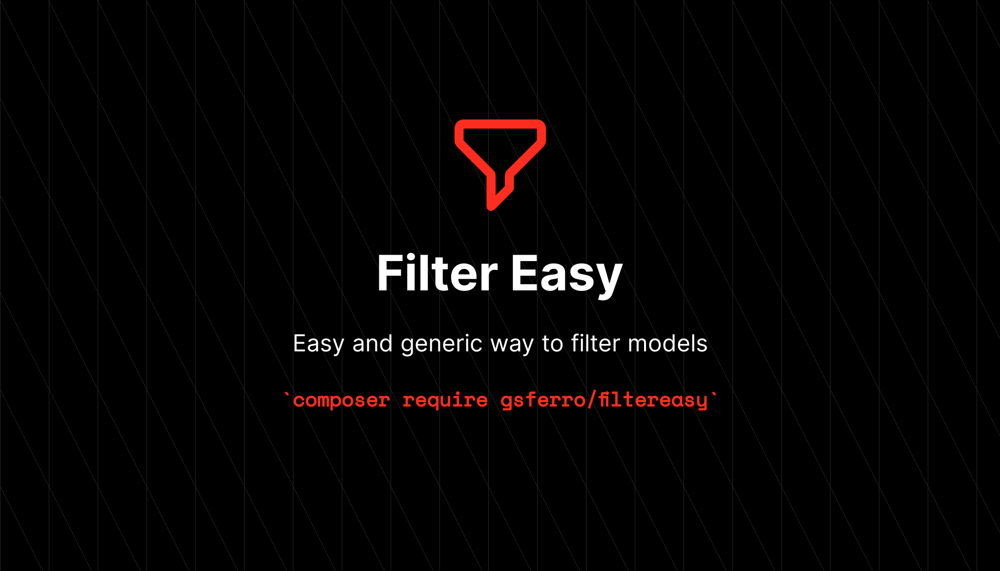

<p align="center">
    
    <p align="center">
        <a href="https://packagist.org/packages/gsferro/filtereasy"></a>
        <a href="https://packagist.org/packages/gsferro/filtereasy"></a>
        <a href="https://packagist.org/packages/gsferro/filtereasy"></a>
    </p>
</p>

------

## Introdução

O FilterEasy é um pacote PHP que permite aplicar filtros em consultas de banco de dados de forma fácil e eficiente. Com ele, você pode criar consultas mais complexas e personalizadas, sem precisar escrever código SQL extenso.

Instalação 

## Instalação:

```shell 
 composer require gsferro/filtereasy
```

## Implementação:

1. Na Model adicione a trait do pacote:
    ```php
    Use FilterEasy;
    ```

1. O pacote se utiliza do padrão `Mass Assignment` do Laravel para tratar os filtros, mas somente os campos do array 
`$fillable` são considerados, com exceção dos relacionamentos, que é explicado logo abaixo.

1. Por default, todos os itens são tratados com a cláusula `where`. 

1. Caso seja enviado um valor contendo um `array`, sera utilizado o`whereIn`.
   - Para `array`, coloque no name um `[]`, exemplo:
       ```php
       permission_id[]
       ```

1. Para verificações utilizando o operador `like` ou uma verificação que force um `bool`, é necessário inicializar os 
seguintes atributos, respectivamente:
    ```php
    /*
    |---------------------------------------------------
    | FilterEasy
    |---------------------------------------------------
    */
    private array $likeFilterFields = [
        // coloque os campos para like
    ];
    
    private array $boolFilterFields = [
        // coloque os campos bool
    ];
    ```

1. Busca com **Datas e Hora**:
   1. Para fazer verificação de periodos de data, usar os `sufixo` a seguir, não precisam ser usados juntos:
       1. `:start`
       1. `:end`

       -  Exemplos:
         - Com o `:start` será implementado `where('created_at', '>=', $value)`
            >  created_at:start
         - Com o `:end` será implementado `where('updated_at', '<=', $value)`  
            >  updated_at:end

    1. Para implementar no formulário de filtro (ou se for utilizar diretamente no controller), basta colocar o attr: 
     `name="created_at:start"` | `name="updated_at:end"`
    
    1. Para implementar uma consulta como a do `whereBetween`, basta colocar o mesmo campo 2x, cada uma com um  `sufixo` 
       -  Exemplo:
       > deleted_at:start
        
       > deleted_at:end 

    - O sql gerado será assim:
      ```` sql
      where (`created_at`) >= ? and (`created_at`) <= ?  
      ````
      
    1. Obs: Até a  `v1.1` era utilizado `whereDate`, porém assim não é possivel enviar também a hora, caso o campo 
    seja um datetime.

1. Para **Relacionamento**:
    
   - Utilize a notação `relationName:relationField` o pacote incluirá o relacionamento na query.
   - Esta notação não precisa estar no `$fillable`, mas o `relationName` precisa ser um relacionamento implementando na 
     model.
     -   Exemplo:
           ```php
           posts:title
           relationName = posts
           relationField = title
           ```
   - Caso queira utilizar o `like`, coloque o `relationName:relationField` no `$likeFilterFields`:
       ```php
       private array  $likeFilterFields = [
           // demais campos
           "posts:title",
     ];
       ```
1. Caso use `$guarded` ou outros campos que não estão no `$fillable`:

    - Inicialize o attributo ``$otherFilterFields``: 
        ```php
       /*
       |---------------------------------------------------
       | FilterEasy
       |---------------------------------------------------
       */
       private array $otherFilterFields = [
       // coloque outros campos que não esteja no fillable
       ];
      ``` 
    -  Exemplo: ``id``, ``uuid``, ``created_at`` , ``updated_at``, ``deleted_at``e etc.

1. Caso queria fazer um `alias` ou precise com um unico paramentro pesquisar em várias colunas (muito comum em apis):
    - Inicialize o atributo `$combinedFilterFields`:
    - Exemplo:
      ```php
      /*
      |---------------------------------------------------
      | FilterEasy
      |---------------------------------------------------
      */
      private array $combinedFilterFields = [
       'client' => [
          'name' => 'like',
          'id' => '=',
          'age' => '>',
        ]
      ];
      ```
      - Nesse caso, ele verificara o valor enviado na posição `client` dentro do `request` e ira setar na 
        query com o `orWhere`; 
      - Ex: Caso tenha enviado um request assim: `client=123`, o `sql` gerado sera:
        ```sql
         select * from users where (name like '123%' or id = 123 or age > 123)
        ```

## Recursos Adicionais

1. Você não precisa sanitizar os dados antes de enviar, o pacote limpa os campos que vierem em branco (`''`) e `null`, 
   mas aceita o `0` como um valor **válido**, pois pode ser usado como um operador `boleano`
1. Use o `filterEasyRequest()`, como `scope`, para pegar todos os dados do request sem precisar passá-los por 
   parâmetro. Pois ele chamara o `filterEasy` pasando a facade `request()->all()` como parâmetro 
1. Se você utilizar o pacote `prettus/l5-repository` ou qualquer outro para `Repository`, recomendo criar a classe 
   `FilterEasyCriteria` já implementando o 
   `filterEasyRequest()`
   1. Implementando assim:
    ```php
    <?php
    
    namespace App\Criteria;
    
    use Prettus\Repository\Contracts\CriteriaInterface;
    use Prettus\Repository\Contracts\RepositoryInterface;
    
    class FilterEasyCriteria implements CriteriaInterface
    {
        /**
         * Apply criteria in query repository
         *
         * @param  string  $model
         * @return mixed
         */
        public function apply($model, RepositoryInterface $repository)
        {
            return $model->filterEasyRequest();
        }
    }
    ```
   2. E para usar, bastando simplesmente: 
   ```php
    public function index(): View
    {
        // set filtereasy
        $this->repository->pushCriteria(new FilterEasyCriteria);

        return view('index', [
            'model' => $this->repository,
        ]);
    }
    ```

## Solução de Problemas
Se você encontrar algum problema ao usar o `FilterEasy`, verifique se:

- A consulta de banco de dados está correta.
- Os filtros estão a ser aplicados corretamente.
- A versão do pacote está atualizada.
- Recursos Adicionais
- Se você inicializou os atributos na model
- Se você tiver um novo campo no model que não estiver listado
- Se você tiver um relacionamento que não estiver implementado na model

## Contribuição
Se você deseja contribuir com o `FilterEasy`, por favor, siga as seguintes etapas:

1. Faça um fork do repositório.
1. Crie uma branch para sua contribuição.
1. Faça as alterações necessárias.
1. Envie um pull request.

## License

O FilterEasy é licenciado sob a licença MIT. Leia o arquivo **[LICENSE](https://opensource.org/licenses/MIT)** para mais informações.
